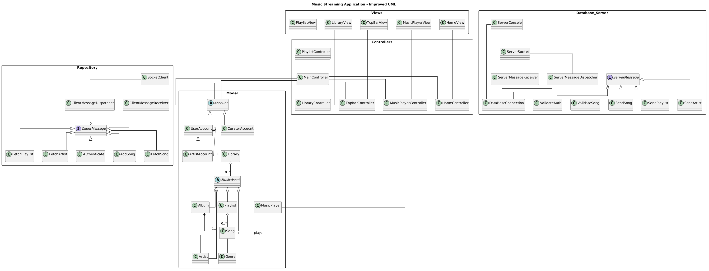

# Domain Model

[UML]

@startuml
title Music Streaming Application - Improved UML

skinparam classAttributeIconSize 0
skinparam linetype ortho
skinparam packageStyle rectangle

'         DOMAIN LAYER

package "Model" {

    ' ---- Accounts ----
    abstract class Account
    class UserAccount
    class ArtistAccount
    class CuratorAccount

    Account <|-- UserAccount
    UserAccount <|-- ArtistAccount
    Account <|-- CuratorAccount

    ' ---- Music Assets ----
    abstract class MusicAsset
    class Artist
    class Album
    class Playlist
    class Song
    class Genre

    MusicAsset <|-- Artist
    MusicAsset <|-- Album
    MusicAsset <|-- Playlist
    MusicAsset <|-- Song  

    ' ---- Relationships ----

    ' A Song belongs to ONE Artist and ONE Genre
    Song -- Artist
    Song -- Genre

    ' An Album is created by ONE Artist
    Album -- Artist

    ' Album contains Songs (strong ownership)
    Album *-- "1..*" Song

    ' Playlist contains Songs (not ownership — songs can exist without playlist)
    Playlist o-- "0..*" Song

    ' User owns a Library
    class Library

    UserAccount "1" *-- "1" Library

    ' Library contains different music assets
    Library o-- "0..*" MusicAsset

    ' ---- Music Player ----
    class MusicPlayer
    MusicPlayer -- "1" Song : plays
}

'        PRESENTATION LAYER

package "Controllers" {

    class MainController

    class MusicPlayerController
    class HomeController
    class LibraryController
    class TopBarController
    class PlaylistController
}

package "Views" {

    class MusicPlayerView
    class HomeView
    class LibraryView
    class TopBarView
    class PlaylistView
}

'         MVC LINKS

' ---- Player MVC ----
MusicPlayerController -- MusicPlayer
MusicPlayerView -- MusicPlayerController
MainController -- MusicPlayerController

' ---- Home MVC ----
HomeView -- HomeController
MainController -- HomeController

' ---- Library MVC ----
LibraryView -- LibraryController
MainController -- LibraryController

' ---- Playlist MVC ----
PlaylistView -- PlaylistController
PlaylistController -- MainController

' ---- Top Bar MVC ----
TopBarView -- TopBarController
MainController -- TopBarController

' ---- Main Controller interacts with current Account ----
MainController -- Account

package "Repository"{
    ' Makes the connection with the server
    class SocketClient
    class ClientMessageDispatcher
    class ClientMessageReceiver
    'Messages the client can send to the server
    interface ClientMessage
    class FetchSong
    class FetchPlaylist
    class FetchArtist
    class Authenticate
    class AddSong
   
}

ClientMessageReceiver --o ClientMessage
ClientMessageDispatcher --o ClientMessage
MainController -- SocketClient
SocketClient -- Account
SocketClient -- ClientMessageDispatcher
ClientMessageReceiver -- MainController
ClientMessage <|-- FetchSong
ClientMessage <|-- FetchPlaylist
ClientMessage <|-- FetchArtist
ClientMessage <|-- Authenticate
ClientMessage <|-- AddSong

'---- Server Side ----
package "Database_Server"{
    class DataBaseConnection
    class ServerSocket
    'ServerConsole only manages the server (starting or stopping it)
    class ServerConsole
    class ServerMessageDispatcher
    class ServerMessageReceiver
    interface ServerMessage
    class SendSong
    class SendPlaylist
    class SendArtist
    class ValidateAuth
    class ValidateSong
}

ServerMessage <|-- SendSong
ServerMessage <|-- SendPlaylist
ServerMessage <|-- SendArtist
ServerMessage <|-- ValidateAuth
ServerMessage <|-- ValidateSong
ServerConsole -- DataBaseConnection
ServerConsole -- ServerSocket
ServerSocket -- ServerMessageReceiver
ServerSocket -- ServerMessageDispatcher
ServerMessageDispatcher -- DataBaseConnection
ServerMessage -- DataBaseConnection

@enduml

[Εικόνα]
