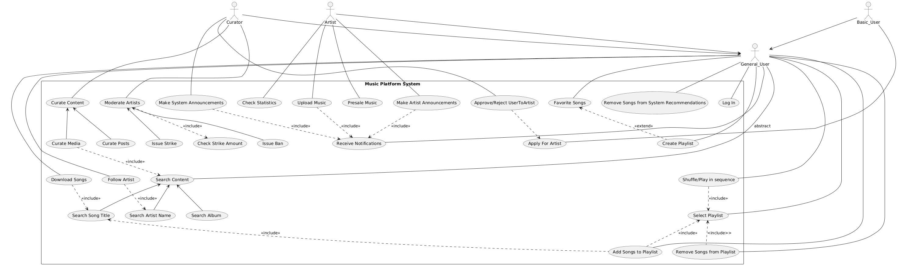

# USE CASE MODEL

@startuml
skinparam packageStyle rectangle

actor General_User
actor Basic_User
actor Premium_User
actor Artist
actor Curator

rectangle "Music Platform System" {

  ' General User Use Cases
  General_User -- (Log In)
  General_User -- (Search Content) : abstract
  General_User -- (Shuffle/Play in sequence)
  General_User -- (Select Playlist)
  General_User -- (Favorite Songs)
  General_User -- (Create Playlist)
  General_User -- (Remove Songs from System Recommendations)
  General_User -- (Follow Artist)
  General_User -- (Add Songs to Playlist)
  General_User -- (Remove Songs from Playlist)

  ' Basic User Use Cases
  Basic_User -- (Apply For Artist)
  
 rectangle "Premium"{
  Basic_User -- (Purchase Premium)
  Basic_User -- (Try Premium)
  
  ' Premium User Use Cases 
  Premium_User -- (Auto-Renew Premium)
  Premium_User -- (Cancel Premium) 
}
  Premium_User -- (Download Songs)
 
rectangle "Artist Hub"{
' Artist Use Cases
  Artist -- (Check Statistics)
  Artist -- (Upload Music)
  Artist -- (Preview Music)
  Artist -- (Receive Monetisation)
}

rectangle "Curator Hub"{
' Curator Use Cases
  Curator -- (Curate Content)
  Curator -- (Moderate Artists)
  Curator -- (Approve/Reject UserToArtist)

  (Moderate Artists) <-- (Issue Strike)
  (Moderate Artists) ..> (Check Strike Amount) : <<include>>
  (Moderate Artists) <-- (Issue Ban)
  (Curate Content) ..> (Search Content) : <<include>>
  (Approve/Reject UserToArtist) ..> (Apply For Artist)
  }

rectangle "Notifications Loop" {
  General_User -- (Receive Notifications)
  Artist -- (Make Artist Announcements) 
  Curator -- (Make System Announcements)
  
  (Approve/Reject UserToArtist) ..> (Receive Notifications) : <<include>>
  (Make System Announcements) ..> (Receive Notifications) : <<include>>
  (Make Artist Announcements) ..> (Receive Notifications) : <<include>>
  (Upload Music) ..> (Receive Notifications) : <<include>>
  (Issue Ban) ..> (Receive Notifications) : <<include>>
  (Issue Strike) ..> (Receive Notifications) : <<include>>
  
}

  ' Relationships
  (Follow Artist) ..> (Search Artist Name) : <<include>>
  (Download Songs) ..> (Search Song Title) : <<include>>
  (Shuffle/Play in sequence) ..> (Select Playlist) : <<include>>
  (Search Content) <-- (Search Artist Name)
  (Search Content) <-- (Search Album )
  (Search Content) <-- (Search Song Title)

  (Favorite Songs) <.. (Create Playlist) : <<extend>>
  (Select Playlist) <.. (Add Songs to Playlist) : <<include>>
  (Search Song Title) <.. (Add Songs to Playlist) : <<include>>
  (Select Playlist) <.. (Remove Songs from Playlist) : <include>>

  (Artist) --> (General_User) 
  (Curator) --> (General_User)
  (Basic_User) --> (General_User)
  (Premium_User) --> (General_User)

}

@enduml

[Εικόνα]

# Επεξήγηση των Use Cases

# Βασική Ροή "Select Playlist"
1. Ο Χρήστης επιλέγει από το navigation panel την επιλογή "Playlist"
2. Το σύστημα ανακτά από το cloud/database όλες τις playlist που έχει δημιουργήσει ή σώσει ο Χρήστης
3. Ο Χρήστης βρίσκει την Playlist που θέλει και την επιλέγει
4. Το σύστημα ανακτά από το cloud/database όλα τα τραγούδια που ανήκουν σε αυτό το playlist και τα εμφανίζει

## Εναλλακτική Ροή 1
2.α.1 Το σύστημα διαπιστώνει ότι ο Χρήστης δεν έχει δημιουργήσει ή σώσει καμία playlist
2.α.2 Το σύστημα παροτρύνει τον χρήστη να δημιουργήσει μία νέα Playlist
2.α.3 Εκτέλεση Βασικής Ροής "Create Playlist" (από το βημα 3)

# Βασική Ροή "Shuffle/Play in sequence"
1. Εκτέλεση Βασικής Ροής "Select Playlist"
2. Ο Χρήστης επιλέγει "Play in sequence"
3. Το σύστημα αρχιζει να αναπαραγει τα τραγούδια με τη σειρα

## Εναλλακτική Ροή 1
2.α.1 Ο Χρήστης επελεγει "Shuffle Play"
2.α.2 Το σύστημα αλλαζει τη σειρα των τραγούδιων με τυχαιο τροπο
2.α.3 Επιστροφη στην Βασική Ροή στο βημα 3

# Βασική Ροή "Add Songs to Playlist"
1. Εκτέλεση Βασικής Ροής "Search Song Title"
2. Ο Χρήστης επιλέγει τις 3 τελείες δίπλα στον τίτλο του τραγούδιού
3. Το σύστημα εμφανίζει ένα μενού επιλογών
4. Ο Χρήστης επιλέγει "Add to Playlist"
5. Εκτέλεση Βασικής Ροής "Select Playlist" (βήματα 2-3)
6. Το σύστημα προσθέτει στην Playlist το επιλεγμένο τραγούδι
7. Το σύστημα κάνει update το νέο περιεχόμενο της playlist στο could/database

## Εναλλακτική Ροή 1
3.α.1 Ο Χρήστης επιλέγει "Add to favorites"
3.α.2 Το σύστημα ανακτά από το cloud/database όλα τα τραγούδια που ανήκουν στο playlist "Favorites"
3.α.3 Επιστροφή στη βασική ροή στο βήμα 6

# Βασική Ροή "Remove Songs from Playlist"
1. Εκτέλεση Βασικής Ροής "Select Playlist"
2. Ο Χρήστης επιλέγει το τραγούδι που θέλει να αφαιρέσει και πατάει τις τρεις τελείες δίπλα στον τίτλο του τραγούδιού
3. Το σύστημα εμφανίζει ένα μενού επιλογών
4. Ο Χρήστης επιλέγει "Remove from Playlist"
5. Το σύστημα αφαιρεί το επιλεγμένο τραγούδι από την Playlist
6. Το σύστημα κάνει update το νέο περιεχόμενο της playlist στο cloud/database

# Βασική Ροή "Apply For Artist"
1. Ο Χρήστης επιλέγει την εικόνα προφίλ του
2. Το σύστημα εμφανίζει το μενού ρυθμίσεων για το προφίλ του χρήστη
3. Ο Χρήστης επιλέγει "Apply for Artist"
4. Το σύστημα εμφανιζει στον χρηστη ενα ερωτηματολογιο, το οποίο ο Χρήστης συμπληρωνει και πατάει "Submit Application"
5. Το σύστημα στέλνει το αίτημα στους Curators

# Βασική Ροή "Approve/Reject UserToArtist"
1. Εκτέλεση Βασικής Ροής "Apply For Artist"
2. Ο Curator ελέγχει αν το προφίλ του χρήστη πληροί τις προϋποθέσεις
3. Ο Curator επιλέγει reject
4. Ο Χρήστης ενημερωνεται για την απαντηση στο αιτημα του
5. Εκτελεση Βασικής Ροής "Receive Notifications"

## Εναλλακτική Ροή 1
3.α.1 Ο Curator επιλεγει approve
3.α.2 Το σύστημα ανανεωνει καταλληλα το cloud/database για την αλλαγη στον τυπο λογαριασμου του χρηστη
3.α.3 Επιστροφη στη Βασική Ροή στο βημα 4

# Βασική Ροή "Remove Songs from System Recommendations"
(θεωρουμε οτι τα recommendations ειναι στην αρχικη οθονη)
1. Ο Χρήστης επιλέγει ένα τραγούδι και πατάει τις τρεις τελείες δίπλα στον τίτλο του τραγούδιού
2. Το σύστημα εμφανίζει ένα μενού επιλογών
3. Ο Χρήστης επιλέγει "Remove from Recommendations"
4. Το σύστημα παύει να εμφανίζει αυτό το τραγούδι στα Recommendations

# Βασική Ροή "Create Playlist"
1. Ο Χρήστης επιλέγει από το navigation panel την επιλογή "Playlist"
2. Ο Χρήστης επιλέγει το κουμπί Create New Playlist
3. Ο Χρήστης εισάγει το όνομα της Playlist, επιλέγει αν θα είναι δημόσια ή ιδιωτική και προεραιτικά προσθέτει μία σύντομη περιγραφή
4. Το σύστημα αποθηκεύει την νέα playlist στο cloud/database

# Βασική Ροή "Search Content"
1. Ο Χρήστης επιλέγει από το navigation panel την επιλογή "Αναζήτηση"
2. Το σύστημα εμφανίζει ένα δεύτερο navigation panel με τις επιλογές για αναζήτηση
3. Ο Χρήστης επιλέγει τον τύπο της αναζήτησης του, και ανάλογα με αυτόν ακολουθούν 3 εναλλακτικές ροές:

## Εναλλακτική Ροή "Search Album"
3.a Ο Χρήστης επιλέγει "Album" και εισάγει στην μπάρα αναζήτησης το όνομα του album
4.a Το σύστημα αναζητεί στο cloud/database όλα τα album με το ίδιο ή παρόμοιο όνομα και τα εμφανίζει στην οθόνη. Στο τέλος των προτάσεων με βάση το τίτλο, θα εμφανίζονται άλμπουμ από τον ίδιο καλλιτέχνη.

## Εναλλακτική Ροή "Search Song Title"
3.b Ο Χρήστης επιλέγει "Song" και εισάγει στην μπάρα αναζήτησης το όνομα του τραγούδιού
4.b Το σύστημα αναζητεί στο cloud/database όλα τα τραγούδια με το ίδιο ή παρόμοιο όνομα και τα εμφανίζει στην οθόνη. Αν η αναζήτηση είναι ακριβής, θα εμφανίζονται αναμίξεις του τραγούδιού και έπειτα τραγούδια από το ίδιο αρχικό άλμπουμ.

## Εναλλακτική Ροή "Search Artist Name"
3.c Ο Χρήστης επιλέγει "Artist" και εισάγει στην μπάρα αναζήτησης το όνομα του artist
4.c Το σύστημα αναζητεί στο cloud/database όλους τους artist με το ίδιο ή παρόμοιο όνομα και τους εμφανίζει στην οθόνη. Κάτω από κάθε καλλιτέχνη θα εμφανίζεται και το δημοφιλέστερο του τραγούδι για ευκολότερη αναζήτηση.

# Βασική Ροή "Follow Artist"
1. Εκτελεση Βασικής Ροής "Search Artist Name"
2. Ο Χρήστης επιλέγει τον artist που θέλει να ακολουθησει και πατάει την εικονα προφιλ του
3. Το σύστημα εμφανίζει πληροφοριες σχετικα με τον καλλιτεχνη
4. Ο Χρήστης επιλέγει το κουμπι "Follow"
5. Το σύστημα κάνει update το προφιλ του χρήστη στο cloud/database για αν περιλαμβανει το νεο artist που ακολουθει ο Χρήστης

# Βασική Ροή "Download Songs"
1. Εκτελεση Βασικής Ροής "Search Song Title"
2. Ο Χρήστης επιλεγει το τραγούδι που θελει να κατεβασει και πατάει τις τρεις τελειες διπλα στον τιτλο του
3. Το σύστημα ελέγχει αν ο Χρήστης είναι στη κατηγορία Premium.

## Εναλλακτική Ροή 1
4.α Ο Χρήστης δεν είναι Premium, το σύστημα εμφανίζει ενα μενού επιλογών, συμπεριλαμβανομένης μιας "Download" επιλογής

## Εναλλακτική Ροή 2
4. Ο Χρήστης είναι "Premium", το σύστημα εμφανίζει ενα μενού επιλογών, συμπεριλαμβανομένης μιας "Download" επιλογής
5. Ο Χρήστης επιλεγει "Download"
6. Το σύστημα αντλεί απο το cloud/database το αρχείο του τραγούδιού, καθως και το path στο οποίο θα κατεβει το αρχείο
7. Το σύστημα κατεβάζει το αρχείο στο δωσμένο path

# Βασική Ροή "Check Statistics"
1. Ο Καλλιτέχνης πατάει στην εικονα προφιλ του
2. Το σύστημα εμφανιζει επιλογες ρυθμισεων για το προφιλ του artist
3. Ο Καλλιτέχνης πατάει την επιλογη "Statistics"
4. Το σύστημα αντλεί δεδομένα απο το cloud/database για τον καλλιτεχνη, κανει υπολογισμους και εμφανιζει γραφηματα στον artist

# Βασική Ροή "Upload Music"
1. Ο Καλλιτέχνης πατάει το κουμπι upload στο navigation panel
2. Το σύστημα ανοιγει το προγραμμα περιηγησης αρχειων του χρηστη
3. Ο Καλλιτέχνης βρισκει και επιλεγει το αρχείο μουσικης που θελει να ανεβασει
4. Ο Καλλιτέχνης εισαγει το ονομα του τραγούδιού, το άλμπουμ στο οποίο ανηκει, καθως και τον αριθμο μεσα στο άλμπουμ, το ετος κυκλοφορησης του τραγούδιού και αλλες επιπροσθετες πληροφοριες
5. Το σύστημα αποθηκευει το νεο τραγούδι στο cloud/database
6. Εκτελεση Βασικής Ροής "Receive Notifications"
**Πρόσθεσε εναλλακτική Ροή Upload Music for Preview**

# Βασική Ροή "Receive Monetisation"

# Βασική Ροή "Notifications Loop"
**Το notifications Loop αποτελείται από 3 sub-use cases. Για να θεωρείται αρκετά "βαθύ" use case, τα έχουμε μαζέψει σε ένα ενιαίο use case.**

## Εναλλακτική Ροή 1 "Receive Notifications"
1. Ο Χρήστης καθορίζει από ποιους καλλιτέχνες λαμβάνει ειδοποιήσεις. (Βασική Ροή Follow Artist)
2. O Χρήστης καθορίζει αν θέλει να λαμβάνει ειδοποιήσεις και στο email μέσω του μενού των ρυθμίσεων της εφαρμογής. Χρησιμοποιείται το email που εισήγαγε κατά τη δημιουργία του λογαριασμού.
3. Ο Χρήστης λαμβάνει τακτικά ειδοποίηση στην εφαρμογή ή στο email του από κάποιον καλλιτέχνη ακολουθεί ή το σύστημα.

## Εναλλακτική Ροή 2 "Make Artist Announcements"
1. Ο Καλλιτέχνης ανεβάζει μουσική/ανακοίνωση, στέλνει request για notification στο σέρβερ αυτόματα. 
2. Ο σερβερ λαμβάνει το request, και διαβάζει τη λίστα των χρηστών οι οποίοι ακολουθούν αυτόν το καλλιτέχνη (Follow Artist)
3. Ο σερβερ προωθεί αντίστοιχη ειδοποίηση στους χρήστες, με όποια εικόνα/κείμενο έχει αναρτηθεί για την ανακοίνωση.

## Εναλλακτική Ροή 3 "Make System Announcements"
1. Ο Curator ανεβάζει ανακοίνωση, στέλνει request για notification στο σέρβερ 
**Το βήμα 1 είναι sub use case για το Curator, αλλά σε διάφορες περιπτώσεις το σύστημα μπορεί να στείλει ειδοποιήσεις μόνο του, ακολουθώντας αυτόματα από το βήμα 2 και έπειτα.**
2. Ο σερβερ λαμβάνει το request, διαβάζει τη λίστα των χρηστών που πρόκειται να πάρουν την ειδοποίηση (Τα System Announcements έχουν εύρος από ένα χρήστη σε περίπτωση Purchase Premium ή Issue Strike μέχρι κάθε χρήστη της εφαρμογής για γενικές ανακοινώσεις)
3. Ο σερβερ προωθεί αντίστοιχη ειδοποίηση στους χρήστες, με όποια εικόνα/κείμενο έχει αναρτηθεί για την ανακοίνωση.

# Βασική Ροή "Curate Content"
1. Ο Curator εντοπιζει το τραγούδι/άλμπουμ/ανακοίνωση το οποίο έχει παραβατικά στοιχεία
2. Ο Curator επιλέγει "remove media", (επιλογή που υπάρχει στο λογαριασμό Curator) και εισάγει μετά από prompt του συστήματος τον λόγο της αφαίρεσης του όποιου περιεχομένου
3. Έπειτα έχει την επιλογή για (εναλλακτική ροή issue strike/issue ban)
4. Ο σερβερ λαμβάνει το removal request, αφαιρεί το υλικό από τον κατάλογο του, και στέλνει ειδοποίηση στο καλλιτεχνη οτι το υλικό έχει αφαιρεθεί, με λόγο ό,τι εισαγάγη από τον Curator και (προεραιτικά) ότι έχει λάβει strike/ban

# Βασική Ροή "Moderate Artists"
**Όπως και το Notification Loop, το Moderate Artists είναι ένα κύριο Use Case το οποίο έχει sub use cases**
1. Εκτελεση Βασικής Ροής "Search Artist Name"
2. Ο Curator επιλεγει τον καλλιτεχνη που θελει να κανει moderate και πατάει τις τρεις τελειες διπλα στο ονομα του
3. Το σύστημα εμφανιζει ενα μενου με επιλογες
4. Ο Curator επιλεγει "Moderate"
5. Εκτελεση Βασικής Ροής "Check Strike Amount"
6. Το σύστημα εμφανιζει στον Curator ενα μενου επιλογων

## Εναλλακτική Ροή 1 "Check Strike Amount"
1. Το σύστημα ανακτα (για δεδομενο καλλιτεχνη) τον αριθμο των strikes του απο τα δεδομένα του στο cloud/database και τα εμφανιζε στον Curator

## Εναλλακτική Ροή 2 "Issue Strike"
1. Εκτελεση Βασικής Ροής "Moderate Artists"
2. Ο Curator επιλεγει "Issue Strike"
3. Το σύστημα καταγραφει την αλλαγη και την αποθηκευει στο cloud/database

## Εναλλακτική Ροή 3 "Issue Ban"
1. Εκτελεση Βασικής Ροής "Moderate Artists"
2. O Curator επιλεγει "Issue Ban"
3. Το σύστημα καταγραφει την αλλαγη και την αποθηκευει στο cloud/database

# Βασική Ροή "Premium"
**Το Premium είναι ένα κύριο Use Case το οποίο έχει sub use cases**

## Εναλλακτική Ροή 1 "Purchase Premium"
## Εναλλακτική Ροή 2 "Try Premium"
## Εναλλακτική Ροή 3 "Cancel Premium"
**Το auto-renew θα είναι βήμα στο Purchase Premium και το Try Premium είναι εναλλακτική έκδοση του Purchase Premium**

