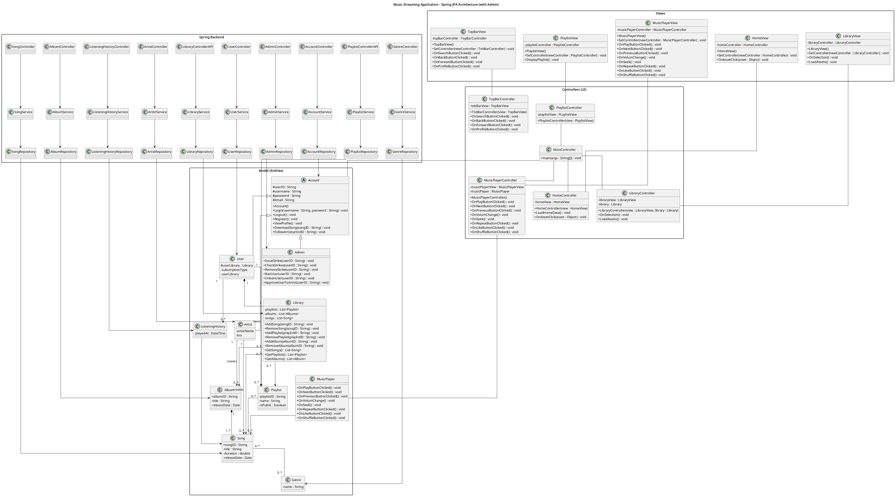

@startuml
title Music Streaming Application - Improved UML

skinparam classAttributeIconSize 0
skinparam linetype ortho
skinparam packageStyle rectangle

'         DOMAIN LAYER

package "Model" {

    ' ---- Accounts ----
    abstract class Account{
    # userID : String
    # username : String
    # password : String
    # email : String
    # userSocket : SocketClient
    # controller : MainController
    + Account()
    + Login(username : String, password : String) : void
    + Logout() : void
    + Register() : void
    + ViewProfile() : void
    + DownloadSong(songID : String) : void
    + FollowArtist(artistID : String) : void
    }

    class UserAccount{
    # userLibrary : Library
    }

    class ArtistAccount

    class CuratorAccount{
    + CuratorAccount()
    + IssueStrike(userID : String) : void
    + CheckStrikes(userID : String) : void
    + RemoveStrike(userID : String) : void
    + BanUser(userID : String) : void
    + UnbanUser(userID : String) : void
    + ApproveUserToArtist(userID : String) : void
    }
    
    Account <|-- UserAccount
    UserAccount <|-- ArtistAccount
    Account <|-- CuratorAccount

    ' ---- Music Assets ----
    abstract class MusicAsset {
    # creator : Artist
    # assetID : String
    + Play() : void
    }
    class Artist
    class Album 
    class Playlist{
    - songs : Song[]
    - name : String
    - playlistID : String
    + Playlist(id : String)
    + Playlist(name : String)
    + AddSong(songID : String) : void
    + RemoveSong(songID : String) : void
    + Rename(newName : String) : void
    + ChangeOrder() : void
    + Play() : void
    + PlaySong() : void
    }
    class Song{
    - songID : String
    - songName : String
    - artist : String
    - duration : float
    + Song(songID : String)
    }
    class Genre{
    - genreID : int
    - name : String
    - songCount : int
    + Genre(id : int, name : String)
    }

    MusicAsset <|-- Artist
    MusicAsset <|-- Album
    MusicAsset <|-- Playlist
    MusicAsset <|-- Song  

    ' ---- Relationships ----

    Song -- Artist
    Song -- Genre

    Album -- Artist

    Album *-- "1..*" Song

    Playlist o-- "0..*" Song

    class Library{
    - libraryAssets : MusicAsset[]
    + Library()
    + AddAsset(asset : MusicAsset) : void
    + RemoveAsset(assetID : String) : void
    + RemoveAsset(asset : MusicAsset) : void
    + GetAssets() : List<MusicAsset>
    }

    UserAccount "1" *-- "1" Library

    Library o-- "0..*" MusicAsset

    ' ---- Music Player ----
    class MusicPlayer{
    - currentSong : Song
    - volume : float
    - isPlaying : boolean
    - normalizedTime : float 
    - volume : float
    + Play() : void
    + Pause() : void
    + Next() : void
    + Previous() : void
    + SetVolume(newVolume : float) : void
    + Seek(newNormalizedTime : float) : void
    + LikeCurrentSong() : void
    + SetRepeatMode() : void
    + SetShuffleMode() : void
    
    }
    MusicPlayer -- "1" Song : plays
}

'        PRESENTATION LAYER

package "Controllers" {

    class MainController{
    + main(args : String[]) : void
    }

    class MusicPlayerController {
    - musicPlayerView : MusicPlayerView
    - musicPlayer : MusicPlayer
    + MusicPlayerController()
    + OnPlayButtonClicked() : void
    + OnNextButtonClicked() : void
    + OnPreviousButtonClicked() : void
    + OnVolumChange() : void
    + OnSeek() : void
    + OnRepeatButtonClicked() : void
    + OnLikeButtonClicked() : void
    + OnShuffleButtonClicked() : void
    }
    class HomeController{
    - homeView : HomeView
    + HomeController(view : HomeView)
    + LoadHomeData() : void
    + OnAssetClick(asset : Object) : void
    }
    class LibraryController{
    - libraryView : LibraryView
    - library : Library
    + LibraryController(view : LibraryView, library : Library)   
    + OnSelection() : void
    + LoadAssets() : void
    }
    class TopBarController{
    - tobBarView : TopBarView
    + TobBarController(view : TopBarView)
    + OnSearchButtonClicked() : void
    + OnBackButtonClicked() : void
    + OnForwardButtonClicked() : void
    + OnProfileButtonClicked() : void
    }
    class PlaylistController{
    - playlistView : PLaylistView
    + PlaylistController(view : PlaylistView)
    }
}

package "Views" {

    class MusicPlayerView{
    - musicPlayerController : MusicPlayerController
    + MusicPlayerView()
    + SetController(newController : MusicPlayerController) : void
    + OnPlayButtonClicked() : void
    + OnNextButtonClicked() : void
    + OnPreviousButtonClicked() : void
    + OnVolumChange() : void
    + OnSeek() : void
    + OnRepeatButtonClicked() : void
    + OnLikeButtonClicked() : void
    + OnShuffleButtonClicked() : void
    }
    class HomeView{
    - homeController : HomeController
    + HomeView()
    + SetController(newController : HomeController) : void
    + OnAssetClick(asset : Object) : void
    }
    class LibraryView{
    - libraryController : LibraryController
    + LibraryView()
    + SetController(newController : LibraryController) : void
    + OnSelection() : void
    + LoadAssets() : void
    }
    class TopBarView{
    - topBarController : TopBarController
    + TopBarView()
    + SetController(newController : TobBarController) : void
    + OnSearchButtonClicked() : void
    + OnBackButtonClicked() : void
    + OnForwardButtonClicked() : void
    + OnProfileButtonClicked() : void
    }
    class PlaylistView{
    - playlistController : PlaylistController
    + PlaylistView()
    + SetController(newController : PlaylistController) : void
    + DisplayPlaylist() : void
    }
}

'         MVC LINKS

MusicPlayerController -- MusicPlayer
MusicPlayerView -- MusicPlayerController
MainController -- MusicPlayerController

HomeView -- HomeController
MainController -- HomeController

LibraryView -- LibraryController
MainController -- LibraryController

PlaylistView -- PlaylistController
PlaylistController -- MainController

TopBarView -- TopBarController
MainController -- TopBarController

MainController -- Account

package "Repository"{
    class SocketClient{
    + {static} SocketClientIntstance : SocketClient
    - serverAddress : String
    - serverPort : int
    - messageDispatcher : ClientMessageDispatcher
    - messageReceiver : ClientMessageReceiver
    + Init(dispatcher : ClientMessageDispatcher, receiver ClientMessageReceiver) : void
    + MakeConnection() : int
    }
    class ClientMessageDispatcher{
    + {static} ClientMessageDispatcherInstance : ClientMessageDispatcher
    + Init() : void
    + DispatchMessage(message : ClientMessage) : void
    }
    class ClientMessageReceiver{
    + {static} ClientMessageReceiverInstance : ClientMessageReceiver
    + Init() : void
    + ReceiveMessage(message : ServerMessage) : void
    }
    interface ClientMessage{
    + GetMessageContents()
    
    }
    class FetchSong
    class FetchPlaylist
    class FetchArtist
    class Authenticate
    class AddSong
}

ClientMessageReceiver --o ClientMessage
ClientMessageDispatcher --o ClientMessage
MainController -- SocketClient
SocketClient -- Account
SocketClient -- ClientMessageDispatcher
ClientMessageReceiver -- MainController
ClientMessage <|-- FetchSong
ClientMessage <|-- FetchPlaylist
ClientMessage <|-- FetchArtist
ClientMessage <|-- Authenticate
ClientMessage <|-- AddSong

package "Database_Server"{
    class DataBaseConnection
    class ServerSocket
    class ServerConsole
    class ServerMessageDispatcher
    class ServerMessageReceiver
    interface ServerMessage
    class SendSong
    class SendPlaylist
    class SendArtist
    class ValidateAuth
    class ValidateSong
}

ServerMessage <|-- SendSong
ServerMessage <|-- SendPlaylist
ServerMessage <|-- SendArtist
ServerMessage <|-- ValidateAuth
ServerMessage <|-- ValidateSong
ServerConsole -- DataBaseConnection
ServerConsole -- ServerSocket
ServerSocket -- ServerMessageReceiver
ServerSocket -- ServerMessageDispatcher
ServerMessageDispatcher -- DataBaseConnection
ServerMessage -- DataBaseConnection

@enduml

[Εικόνα]
